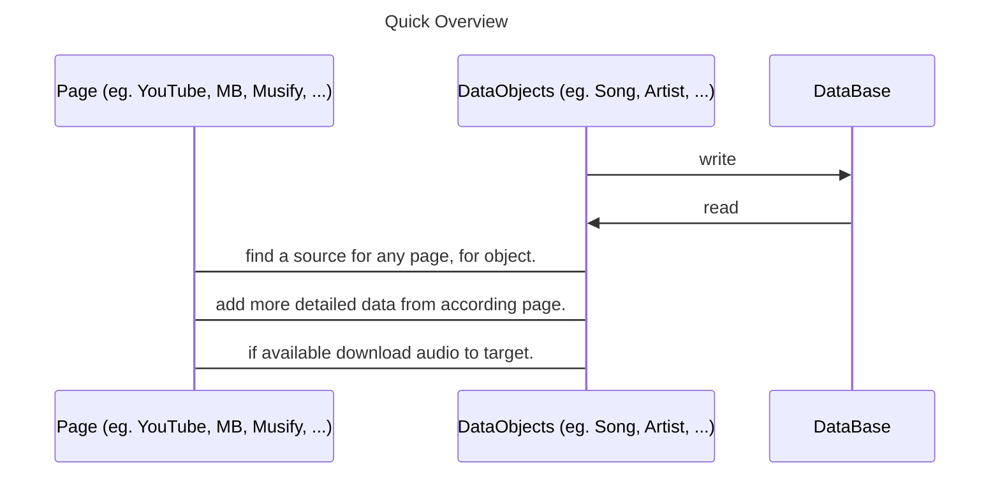
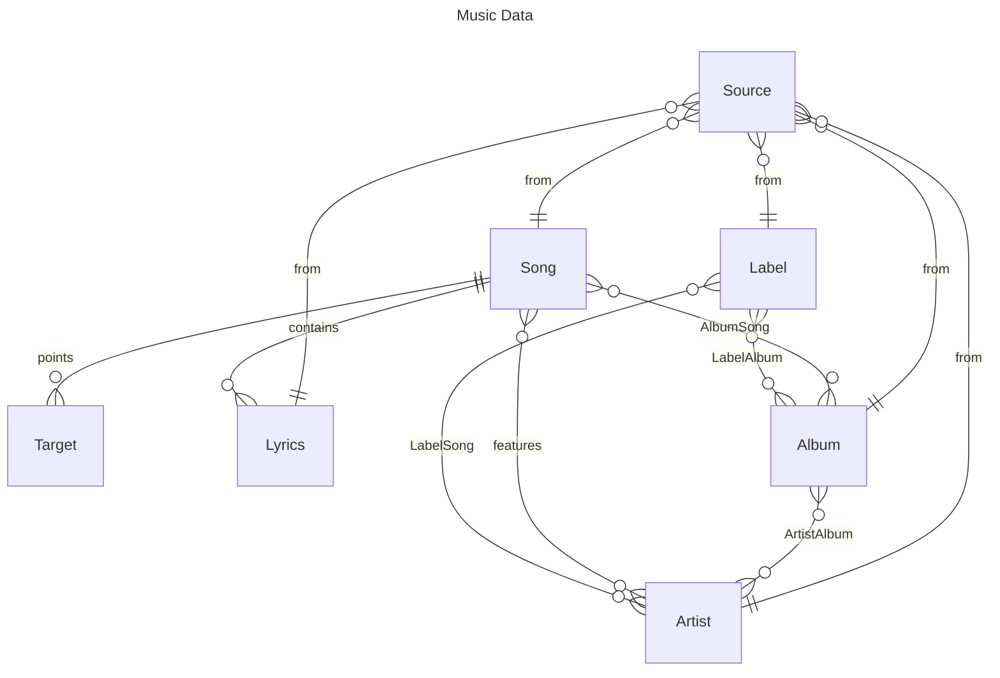
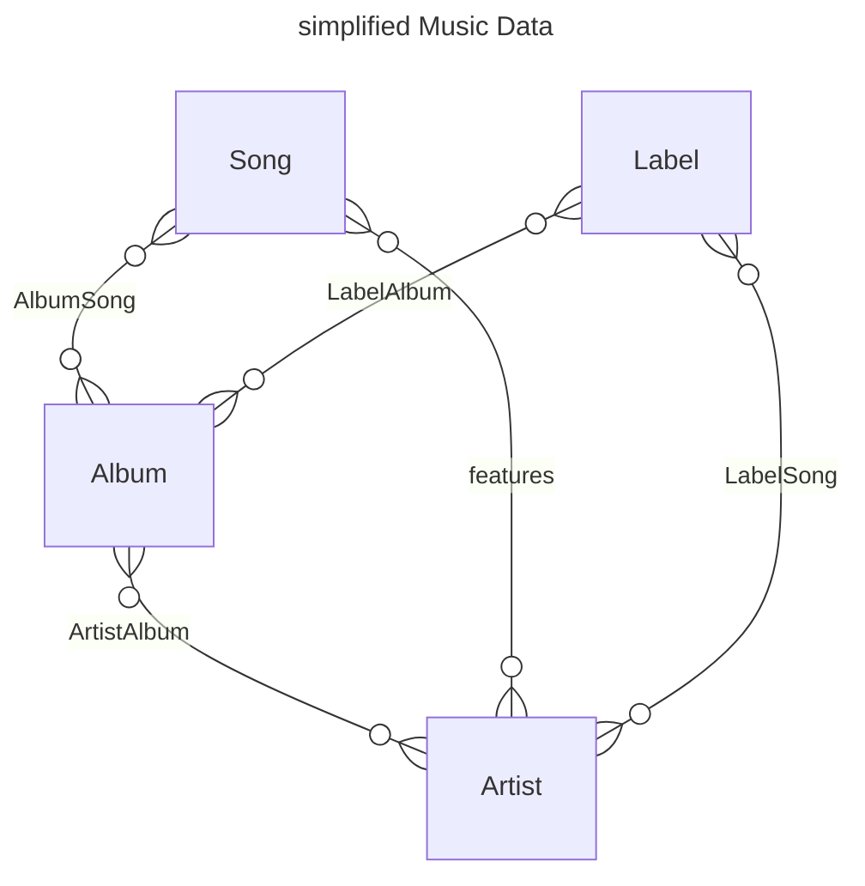
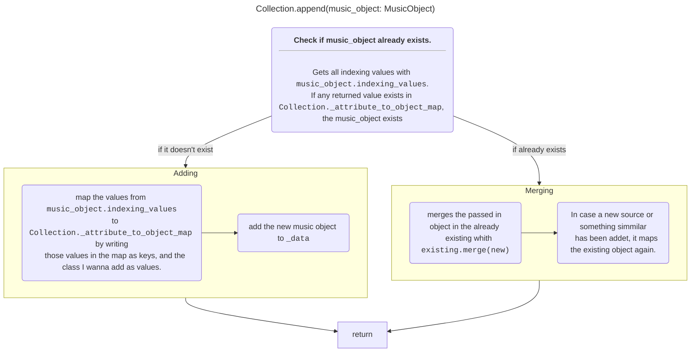

# Music Kraken 


- [Music Kraken](#music-kraken)
  - [Installation](#installation)
    - [Notes for Python 3.9](#notes-for-python-39)
    - [Notes for WSL](#notes-for-wsl)
  - [Quick-Guide](#quick-guide)
  - [CONTRIBUTE](#contribute)
  - [Matrix Space](#matrix-space)
- [Programming Interface / Use as Library](#programming-interface--use-as-library)
  - [Quick Overview](#quick-overview)
  - [Data Model](#data-model)
  - [Data Objects](#data-objects)
    - [Creation](#creation)
  - [Appending and Merging data](#appending-and-merging-data)

---

## Installation

You can find and get this project from either [PyPI](https://pypi.org/project/music-kraken/) as a Python-Package, 
or simply the source code from [GitHub](https://github.com/HeIIow2/music-downloader). Note that even though
everything **SHOULD** work cross-platform, I have only tested it on Ubuntu.
If you enjoy this project, feel free to give it a star on GitHub.

```sh
# Install it with
pip install music-kraken

# and simply run it like this:
music-kraken
```

## Dependencies
- ffmpeg
- pandoc

### Notes for Python 3.9

Unfortunately I use features that newly git introduced in [Python 3.10](https://docs.python.org/3/library/types.html#types.UnionType).
So unfortunately you **CAN'T** run this programm with python 3.9. [#10][i10] 

### Notes for WSL

If you choose to run it in WSL, make sure ` ~/.local/bin` is added to your `$PATH` [#2][i2]

## Quick-Guide

**Genre:** First, the cli asks you to input a genre you want to download to. The options it gives you (if it gives you any) are all the folders you have in the music directory. You can also just input a new one.

**What to download:** After that it prompts you for a search. Here are a couple examples how you can search:

```
> #a <any artist>
searches for the artist <any artist>

> #a <any artist> #r <any releas>
searches for the release (album) <any release> by the artist <any artist>

> #r <any release> Me #t <any track>
searches for the track <any track> from the release <any relaese>
```

After searching with this syntax, it prompts you with multiple results. You can either choose one of those by inputing its id `int`, or you can search for a new query.

After you chose either an artist, a release group, a release, or a track by its id, download it by inputting the string `ok`. My downloader will download it automatically for you.

---

## CONTRIBUTE

I am happy about every pull request. To contribute look [here](contribute.md).

## Matrix Space 


I decided against creating a discord server, due to piracy communities get often banned from discord. A good and free Alternative are Matrix Spaces. I reccomend the use of the Client [Element](https://element.io/download). It is completely open source.

**Click [this link](https://matrix.to/#/#music-kraken:matrix.org) _([https://matrix.to/#/#music-kraken:matrix.org](https://matrix.to/#/#music-kraken:matrix.org))_ to join.**

---

# Programming Interface / Use as Library

This application is $100\%$ centered around Data. Thus the most important thing for working with musik kraken is, to understand how I structured the data.  

## Quick Overview

- explanation of the [Data Model](#data-model)
- how to use the [Data Objects](#data-objects)
- further Dokumentation of *hopefully* [most relevant classes](documentation/objects.md)
- the [old implementation](documentation/old_implementation.md)



## Data Model

The Data Structure, that the whole programm is built on looks as follows:



Ok now this **WILL** look intimidating, thus I break it down quickly.  
*That is also the reason I didn't add all Attributes here.*

The most important Entities are:

- Song
- Album
- Artist
- Label

All of them *(and Lyrics)* can have multiple Sources, and every Source can only Point to one of those Element.

The `Target` Entity represents the location on the hard drive a Song has. One Song can have multiple download Locations.

The `Lyrics` Entity simply represents the Lyrics of each Song. One Song can have multiple Lyrics, e.g. Translations.

Here is the simplified Diagramm without only the main Entities.




Looks way more manageable, doesn't it? 

The reason every relation here is a `n:m` *(many to many)* relation is not, that it makes sense in the aspekt of modeling reality, but to be able to put data from many Sources in the same Data Model.  
Every Service models Data a bit different, and projecting a one-to-many relationship to a many to many relationship without data loss is easy. The other way around it is basically impossible

## Data Objects

> Not 100% accurate yet and *might* change slightly

### Creation

```python
# importing the libraries I build on 
from music_kraken import objects

import pycountry


song = objects.Song(
    genre="HS Core",
    title="Vein Deep in the Solution",
    length=666,
    isrc="US-S1Z-99-00001",
    tracksort=2,
    target=[
        objects.Target(file="song.mp3", path="example")
    ],
    lyrics_list=[
        objects.Lyrics(text="these are some depressive lyrics", language="en"),
        objects.Lyrics(text="Dies sind depressive Lyrics", language="de")
    ],
    source_list=[
        objects.Source(objects.SourcePages.YOUTUBE, "https://youtu.be/dfnsdajlhkjhsd"),
        objects.Source(objects.SourcePages.MUSIFY, "https://ln.topdf.de/Music-Kraken/")
    ],
    album_list=[
        objects.Album(
            title="One Final Action",
            date=objects.ID3Timestamp(year=1986, month=3, day=1),
            language=pycountry.languages.get(alpha_2="en"),
            label_list=[
                objects.Label(name="an album label")
            ],
            source_list=[
                    objects.Source(objects.SourcePages.ENCYCLOPAEDIA_METALLUM, "https://www.metal-archives.com/albums/I%27m_in_a_Coffin/One_Final_Action/207614")
                ]
        ),
    ],
    main_artist_list=[
        objects.Artist(
            name="I'm in a coffin",
            source_list=[
                objects.Source(
                    objects.SourcePages.ENCYCLOPAEDIA_METALLUM,
                    "https://www.metal-archives.com/bands/I%27m_in_a_Coffin/127727"
                    )
            ]
        ),
        objects.Artist(name="some_split_artist")
    ],
    feature_artist_list=[
        objects.Artist(
            name="Ruffiction",
            label_list=[
                objects.Label(name="Ruffiction Productions")
            ]
        )
    ],
)

print(song.option_string)
for album in song.album_collection:
    print(album.option_string)
for artist in song.main_artist_collection:
    print(artist.option_string)
```


If you just want to start implementing, then just use the code example, I don't care.  
For those who don't want any bugs and use it as intended *(which is recommended, cuz I am only one person so there are defs bugs)* continue reading.

## Appending and Merging data

If you want to append for example a Song to an Album, you obviously need to check beforehand if the Song already exists in the Album, and if so, you need to merge their data in one Song object, to not loose any Information.

This is how I solve this problem:



This is Implemented in [music_kraken.objects.Collection.append()](documentation/objects.md#collection). The merging which is mentioned in the flowchart is explained in the documentation of [DatabaseObject.merge()](documentation/objects.md#databaseobjectmerge).

The <u>indexing values</u> are defined in the superclass [DatabaseObject](documentation/objects.md#databaseobject) and get implemented for each Object seperately. I will just give as example its implementation for the `Song` class:

```python
@property
def indexing_values(self) -> List[Tuple[str, object]]:
    return [
        ('id', self.id),
        ('title', self.unified_title),
        ('barcode', self.barcode),
        *[('url', source.url) for source in self.source_collection]
    ]
```

[i10]: https://github.com/HeIIow2/music-downloader/issues/10
[i2]: https://github.com/HeIIow2/music-downloader/issues/2
