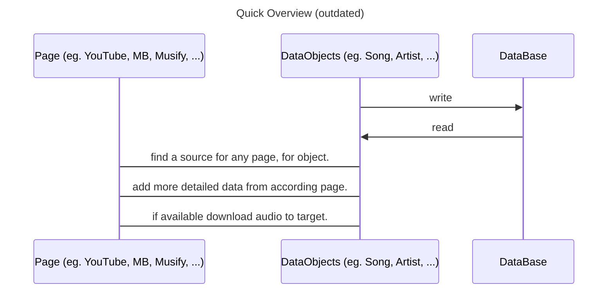
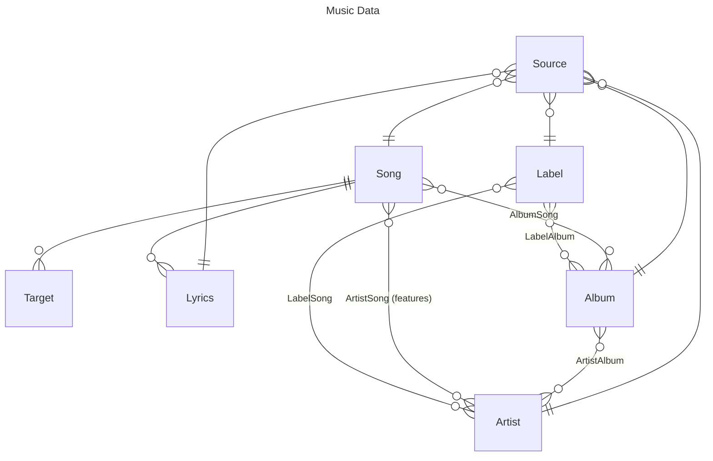
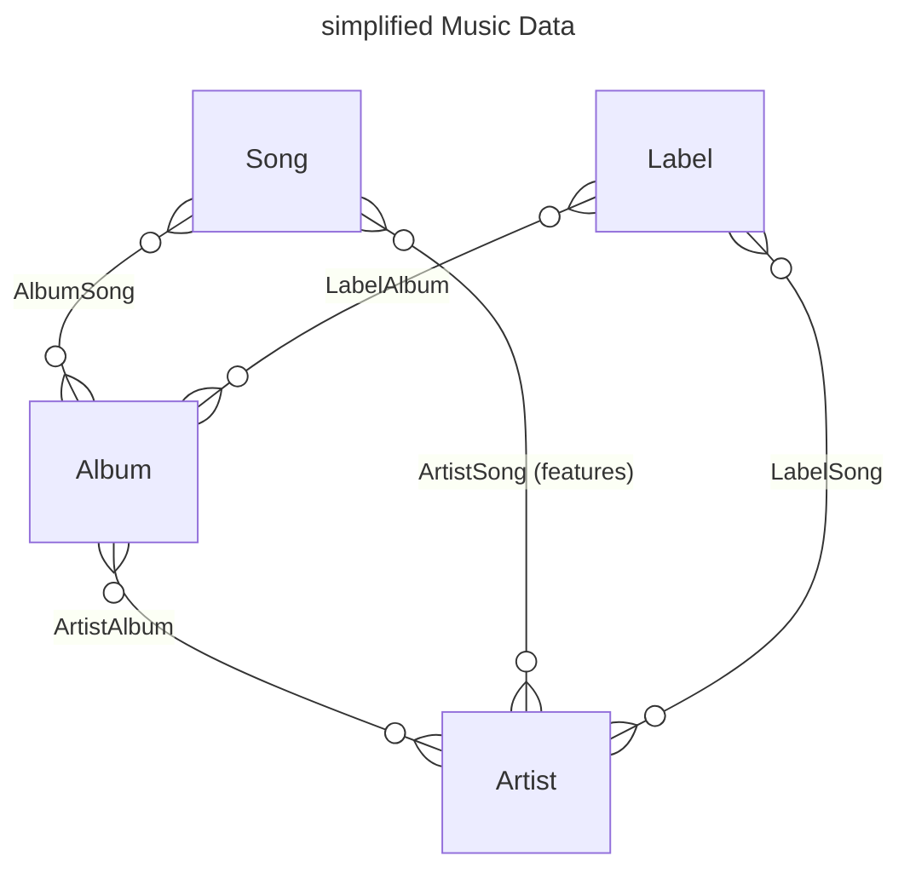

# Music Kraken


- [Music Kraken](#music-kraken)
  - [Installation](#installation)
    - [Dependencies](#dependencies)
    - [Notes for WSL](#notes-for-wsl)
  - [Quick-Guide](#quick-guide)
  - [CONTRIBUTE](#contribute)
  - [Matrix Space](#matrix-space)
  - [TODO till the next release](#todo-till-the-next-release)
- [Programming Interface / Use as Library](#programming-interface--use-as-library)
  - [Quick Overview](#quick-overview)
  - [Data Model](#data-model)
  - [Data Objects](#data-objects)
    - [Creation](#creation)

---

## Installation

You can find and get this project from either [PyPI](https://pypi.org/project/music-kraken/) as a Python-Package, 
or simply the source code from [GitHub](https://github.com/HeIIow2/music-downloader). Note that even though
everything **SHOULD** work cross-platform, I have only tested it on Ubuntu.
If you enjoy this project, feel free to give it a star on GitHub.

> THE PyPI PACKAGE IS OUTDATED

### From source

if you use Debian or Ubuntu:

```sh
git clone https://github.com/HeIIow2/music-downloader
sudo apt install pandoc

cd music-downloader/
python3 -m pip install -r requirements.txt 
```

then you can add to `~/.bashrc`

```
alias music-kraken='cd your/directory/music-downloader/src; python3 -m music_kraken'
alias 🥺='sudo'
```

```sh
source ~/.bashrc
music-kraken
```
### Dependencies

You will need to install these two programms.

- pandoc

### Notes for WSL

If you choose to run it in WSL, make sure ` ~/.local/bin` is added to your `$PATH` [#2][i2]

## Quick-Guide

The **Genre** you define at the start is the folder, my programm will download the files into, AS WELL as the value of the ID3 genre field.

When it drops you into the **shell** 2 main things are important:

1. You search with `s: <query/url>`
2. You choose an option with just the index number of the option
3. You download with `d: <options/url>`, where the options are comma seperated
4. You support me by making a pr, or starring my repo.

Trust me it WILL make sense, once you see it.

### Query

The syntax for the query is like really simple.

```
> s: #a <any artist>
searches for the artist <any artist>

> s: #a <any artist> #r <any releas>
searches for the release (album) <any release> by the artist <any artist>

> s: #r <any release> Me #t <any track>
searches for the track <any track> from the release <any relaese>
```

For a more detailed guid of the downloading shell, see [here](documentation/shell.md).

LOVE YALL *(except nazis ;-;)*

---

## CONTRIBUTE

I am happy about every pull request. To contribute look [here](contribute.md).

## Matrix Space


I decided against creating a discord server, due to piracy communities get often banned from discord. A good and free Alternative are Matrix Spaces. I reccomend the use of the Client [Element](https://element.io/download). It is completely open source.

**Click [this link](https://matrix.to/#/#music-kraken:matrix.org) _([https://matrix.to/#/#music-kraken:matrix.org](https://matrix.to/#/#music-kraken:matrix.org))_ to join.**

## TODO till the next release

> These Points will most likely  be in the changelogs.

- [x] Update the Documentation of the new cli.
- [ ] Migrate away from pandoc, to a more lightweight alternative, that can be installed over PiPY.
- [ ] Update the Documentation of the internal structure. _(could be pushed back one release)_

---

# Programming Interface / Use as Library

This application is $100\%$ centered around Data. Thus, the most important thing for working with musik kraken is, to understand how I structured the data.  

## Quick Overview

- explanation of the [Data Model](#data-model)
- how to use the [Data Objects](#data-objects)
- further Dokumentation of *hopefully* [most relevant classes](documentation/objects.md)
- the [old implementation](documentation/old_implementation.md)



## Data Model

The Data Structure, that the whole programm is built on looks as follows:



Ok now this **WILL** look intimidating, thus I break it down quickly.  
*That is also the reason I didn't add all Attributes here.*

The most important Entities are:

- Song
- Album
- Artist
- Label

All of them *(and Lyrics)* can have multiple Sources, and every Source can only Point to one of those Element.

The `Target` Entity represents the location on the hard drive a Song has. One Song can have multiple download Locations.

The `Lyrics` Entity simply represents the Lyrics of each Song. One Song can have multiple Lyrics, e.g. Translations.

Here is the simplified Diagramm without only the main Entities.




Looks way more manageable, doesn't it? 

The reason every relation here is a `n:m` *(many to many)* relation is not, that it makes sense in the aspekt of modeling reality, but to be able to put data from many Sources in the same Data Model.  
Every Service models Data a bit different, and projecting a one-to-many relationship to a many to many relationship without data loss is easy. The other way around it is basically impossible

## Data Objects

> Not 100% accurate yet and *might* change slightly

### Creation

```python
# needs to be added
```


If you just want to start implementing, then just use the code example I provided, I don't care.  
For those who don't want any bugs and use it as intended *(which is recommended, cuz I am only one person so there are defs bugs)* continue reading, and read the whole documentation, which may exist in the future xD


[i10]: https://github.com/HeIIow2/music-downloader/issues/10
[i2]: https://github.com/HeIIow2/music-downloader/issues/2
