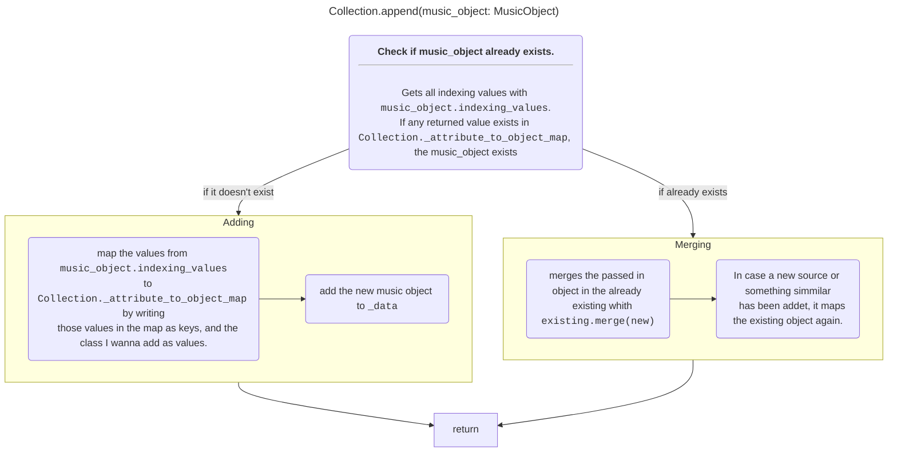

# music_kraken.objects

## DatabaseObject

[music_kraken.objects.DatabaseObject](../src/music_kraken/objects/parents.py)

This is a parent object, which most Music-Objects inherit from. It provides the **functionality** to:

- autogenerate id's *(UUID)*, if not passed in the constructur.
- [merge](#databaseobjectmerge) the data of another instance of the same time in self.
- Check if two different instances of the same type represent the same data, using `__eq__`.

Additionally it provides an **Interface** to:

- define the attributes used to [merge](#databaseobjectmerge).
- define the attribuse and values used to check for equal data. *(used in `__eq__` and in the merge)*
- get the id3 [metadata](#metadata).
- get all [options](#options) *(used in searching from e.g. the command line)*

### DatabaseObject.merge()

To  merge the data of two instances of the same type, the attributes defined in `DatabaseObject.COLLECTION_ATTRIBUTES` and `SIMPLE_ATTRIBUTES` are used.

The simple attributes just get carried from the other instance, to the self instance.

The collection attributes appends all elements from other.collection to self.collection, but ofc [checks if already exists](#collection).

## Collection

[music_kraken.objects.Collection](../src/music_kraken/objects/collection.py)

This is an object, which acts as a list. You can save instaces of a subclass of [DatabaseObject](#databaseobject).

Then you can for example append a new Object. The difference to a normal list is, that if you have two different objects that both represent the same data, it doesn't get added, but all data gets [merged](#databaseobjectmerge) into the existing Object instead.

For example, you have two different Artist-Objects, where both have one source in common. The one Artist-Object already is in the Collection. The other artist object is passed in the append command.  
In this case it doesn't simply add the artist object to the collection, but modifies the already existing Artist-Object, adding all attributes the new artist object has, and then discards the other object.

```python
artist_collection = Collection(element_type=Artist)

# adds the artist to the list (len 1)
artist_collection.append(artist_1)

# detects artist 2 has a mutual source
# thus not adding but mergin (len 1)
artist_collection.appent(artist_2)
```

Function | Explanation
---|---
`append()` | appends an object to the collection
`extend()` | appends a list of objects to the collection
`__len__()` | gets the ammount of objects in collection
`shallow_list` | gets a shallow copy of the list `_data` the objects are contained in
`sort()` | takes the same arguments than `list.sort`, and does the same
`__iter__()` | allows you to use collections e.g. a for loop

### Appending and Merging data

If you want to append for example a Song to an Album, you obviously need to check beforehand if the Song already exists in the Album, and if so, you need to merge their data in one Song object, to not loose any Information.

This is how I solve this problem:



This is Implemented in [music_kraken.objects.Collection.append()](documentation/objects.md#collection). The merging which is mentioned in the flowchart is explained in the documentation of [DatabaseObject.merge()](documentation/objects.md#databaseobjectmerge).

The <u>indexing values</u> are defined in the superclass [DatabaseObject](documentation/objects.md#databaseobject) and get implemented for each Object seperately. I will just give as example its implementation for the `Song` class:

```python
@property
def indexing_values(self) -> List[Tuple[str, object]]:
    return [
        ('id', self.id),
        ('title', self.unified_title),
        ('barcode', self.barcode),
        *[('url', source.url) for source in self.source_collection]
    ]
```

## Song

This object inherits from [DatabaseObject](#databaseobject) and implements all its interfaces.

It has handful attributes, where half of em are self-explanatory, like `title` or `genre`. The ones like `isrc` are only relevant to you, if you know what it is, so I won't elaborate on it.

Interesting is the `date`. It uses a custom class. More on that [here](#music_krakenid3timestamp).

## ID3Timestamp

For multiple Reasons I don't use the default `datetime.datetime` class.

The most important reason is, that you need to pass in at least year, month and day. For every other values there are default values, that are indistinguishable from values that are directly passed in. But I need optional values. The ID3 standart allows default values. Additionally `datetime.datetime` is immutable, thus I can't inherint all the methods. Sorry.

Anyway you can create those custom objects easily.

```python
from music_kraken import ID3Timestamp

# returns an instance of ID3Timestamp with the current time
ID3Timestamp.now()

# returns an instance of ID3Timestamp with the given values
# all values are optional if unknown
ID3Timestamp(year=1986, month=3, day=1, hour=12, minute=30, second=6)
```
